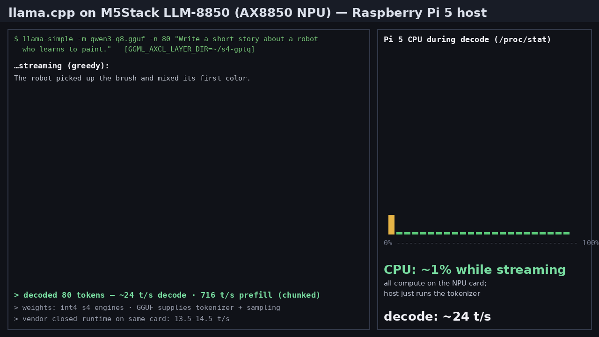

# ggml-axcl — llama.cpp Axera NPU backend



A custom [llama.cpp](https://github.com/ggml-org/llama.cpp) backend (`ggml-axcl`) that runs
Qwen3-0.6B **directly from GGUF** on an Axera AX8850 NPU accelerator card
(M5Stack LLM-8850: 24 TOPS INT8, 8 GB LPDDR4x) hosted on a Raspberry Pi 5.

**The GGUF is the only model artifact.** At load time the GGUF's weights are
dequantized and patched into pre-compiled whole-layer NPU engines — no model
conversion, no per-model compile step. Q8_0 and Q4_K_M quants work from the
same code path.

| Mode | Quant | decode | prefill* | CPU load | card CMM |
|---|---|---|---|---|---|
| **Qwen3.5-0.8B hybrid** (vendor w4a16 engine set, 18 delta-net + 6 attn layers) | any GGUF | **27.0 t/s** @ short ctx, 25.2 @ 2k | per-token (~5 t/s) | **~0%** | **0.9 GB** |
| s4 kv1024 (1k ctx cap) *(axcl V3.10.2 stack)* | int4 g128 | 29.9 t/s | ~700 t/s (chunked) | **~0%** | ~0.6 GB |
| s4 + trimmed post (90.9k vocab) *(axcl V3.10.2 stack)* | int4 g128 | 26.8 t/s | ~700 t/s (chunked) | **~0%** | ~0.8 GB |
| **s4-GPTQ mode** (llm_build2 s4 engines from a GPTQ-g128 ckpt, 2k ctx) | int4 g128 | **24.5 t/s** | **1,276 t/s** (chunked) | **~0%** | ~0.8 GB |
| **GGUF-int8 mode** (GGUF weights patched into int8 w8a16 engines) | q8_0 | **19.5 t/s** | 18.1 t/s | **~0%** | **1.1 GB** |
| Vendor-engine mode (int8 w8a16 engines, engines' own weights) | q8_0 | **19.7 t/s** | 18.5 t/s | **2%** of one core | **1.3 GB** |
| Vendor-engine mode (int8 w8a16 engines, engines' own weights) | Q4_K_M | **19.6 t/s** | 18.3 t/s | **2%** of one core | **1.3 GB** |
| Dynamic-GGUF mode (GGUF weights, bf16 engines) | q8_0 | 10.2 t/s | 5.0 t/s | ~5% | 2.4 GB |
| Dynamic-GGUF mode (GGUF weights, bf16 engines) | Q4_K_M | 10.1 t/s | 5.0 t/s | ~5% | 2.4 GB |
| Baked-weights mode (bf16 engines) | — | 10.1 t/s | 5.0 t/s | ~5% | 2.4 GB |
| Legacy per-op mode (superseded) | — | 2.2 t/s | 1.6 t/s | ~100% | 5.5 GB |
| Vendor closed runtime (their engine + their runner) | w8a16 | 13.5–14.5 t/s | — | — | — |

\* steady per-token prefill (376-token prompt), two runs each, best pair
shown. Measured on Pi 5, CPU governor `performance`, axcl V3.6.5_P1.
Vendor-engine mode quant column = the GGUF supplying tokenizer/graph/
sampling; model compute is identical for both quants (engines carry their
own weights), which the numbers confirm.

**Headline: ~23 t/s decode on int4 s4 engines (24.5 measured on the
axcl V3.10.2 stack) and 1,276 t/s prompt processing, with the Pi's CPU idle; the GGUF-int8 mode below
additionally patches the GGUF's own weights into int8 engines (96%
token agreement) — beating the vendor's closed runtime (13.5–14.5 t/s
on the same card) in every mode. Verified stack: the M5Stack axclhost
3.6.5-m5stack1 driver (backup in driver-good/).**

Fidelity (greedy prefix-token agreement vs the CPU reference of the same
GGUF, 10 prompts × 24 tokens): **GGUF-int8 mode q8_0 96%**; vendor-engine
mode q8_0 **94%** / Q4_K_M **90%**; dynamic-GGUF mode q8_0 **91%** /
Q4_K_M **93%**. Divergence is near-tie tokens under different weight
numerics, not gross corruption. Known-answer/code/coherence evals
(`gemm/eval_suite.sh`): GGUF-int8 mode scores 6/8 — the identical
profile to the CPU reference of the same GGUF (the two shared misses:
one model near-miss completion, one eval-script quirk that "fails"
healthy lexical diversity); vendor-engine mode scores 7/8 but diverges
from the reference on the arithmetic near-miss.

## Quick start

On the **Pi** (kram@10.0.0.81 in this setup; any aarch64 host with the AXCL
driver works):

```bash
# build llama.cpp with the backend
git clone -b Axera-8850-GGUF-support-PoC-qwen3-0.9b-Q4KM-Q8 \
    https://github.com/woolcoxm/llama.cpp
cmake -B build-axcl -S llama.cpp -DGGML_AXCL=ON
cmake --build build-axcl -j4

# install the engine set (templates + post + layout sidecar)
sudo mkdir -p /usr/local/share/ggml-axcl/layer
# from the LLMTest repo (built on the x86 box, see below):
scp gemm/baked/real2048_bf16/qwen3_p128_l*_together.axmodel pi:/usr/local/share/ggml-axcl/layer/
scp gemm/baked/real2048_bf16/qwen3_post.axmodel       pi:/usr/local/share/ggml-axcl/layer/
scp gemm/layout_v4.bin                                pi:/usr/local/share/ggml-axcl/layer/

# fastest mode with GGUF weights: patch the int8 engines from the GGUF
# (on the x86 box, ~2 min; one-time per GGUF):
python3 gemm/gguf_patch_w8.py model-q8_0.gguf <vendor_engine_dir> out-dir
scp out-dir/*.axmodel pi:~/gguf-i8/
# on the Pi (post engine copied alongside):
GGML_AXCL_LAYER=1 GGML_AXCL_FA=1 GGML_AXCL_STREAM=1 \
    GGML_AXCL_LAYER_DIR=$HOME/gguf-i8 \
    GGML_AXCL_POST_MODEL=$HOME/gguf-i8/qwen3_post.axmodel \
    ~/build-axcl/bin/llama-simple -m ~/models/qwen3-q8.gguf -n 48 "Your prompt"

# vendor-engine mode (no patching; engines carry their own weights — the
# GGUF supplies tokenizer/graph/sampling)
GGML_AXCL_LAYER=1 GGML_AXCL_FA=1 GGML_AXCL_STREAM=1 \
    GGML_AXCL_LAYER_DIR=$HOME/Qwen3-0.6B \
    GGML_AXCL_POST_MODEL=$HOME/Qwen3-0.6B/qwen3_post.axmodel \
    ~/build-axcl/bin/llama-simple -m ~/models/qwen3-q8.gguf -n 48 "Your prompt"

# flagship mode: the GGUF's own weights flow into (bf16) engines at load
GGML_AXCL_GGUF=1 GGML_AXCL_LAYER=1 GGML_AXCL_FA=1 \
    ~/build-axcl/bin/llama-simple -m ~/models/qwen3-q8.gguf -n 48 "Your prompt"
```

Notes:
- llama-simple takes the prompt as a **positional argument** (not `-p`), and
  `-n` must come *before* the prompt. It parses only `-m`/`-n`/`-ngl` — other
  flags like `-c` fall into the prompt text.
- **Qwen3.5-0.8B** (hybrid architecture): drop the
  [AXERA-TECH Qwen3.5-0.8B-AX650-GPTQ-Int4](https://huggingface.co/AXERA-TECH/Qwen3.5-0.8B-AX650-GPTQ-Int4-C128-P1152-CTX2047)
  engine dir in as `GGML_AXCL_LAYER_DIR` and any Qwen3.5-0.8B GGUF — no
  other env changes. The set is autodetected (24 layers: 18 gated-delta-net
  + 6 full-attention), per-layer IO geometry comes from the runtime API, and
  the delta-net layers' conv/SSM state lives on-card (ping-pong state
  buffers, 1.0 gate masks). Measured: 27.0 t/s decode short-ctx / 25.2 t/s
  near 2k ctx, 894 MiB CMM — fits the 4 GB card with room to spare. The
  GGUF supplies tokenizer/graph/sampling; the engines carry the weights
  (both Q4_K_M and Q8_0 GGUFs verified). Chunked prefill off for this arch
  until the hybrid ladder semantics are validated.
- First run per GGUF patches 28 engines (~30s, cached afterwards in
  `/tmp/axcl-gguf`, keyed by a hash of the weights). Warm starts take ~60s
  to load 28×65MB engines into card memory.
- `GGML_AXCL_LAYER=1 GGML_AXCL_FA=1` alone runs the baked template weights
  (HF f32-derived); add `GGML_AXCL_GGUF=1` to patch in the GGUF's weights.
- Vendor-engine mode needs the `AXERA-TECH/Qwen3-0.6B` w8a16 package
  (axmodels use the same filenames and IO conventions — just point
  `GGML_AXCL_LAYER_DIR` at it).

## The optimization story (7.9 → 19.6 t/s)

Measured at the start of the push: **7.96 t/s = 125.6 ms/token**, split
90.6 ms inside the 28 whole-layer engine executes (DRAM-bound bf16 weight
traffic) and **~35 ms of host-side orchestration**. Both halves were
attacked:

### 1. Host pipeline: 35 ms → ~2 ms outside the engines
- **Pinned everything.** On this stack an unpinned small transfer costs
  ~1 ms (per-transfer page pinning) — the per-layer 4-byte index upload and
  2 KB KV write-backs ran from stack buffers. All hot transfers now use
  `axclrtMallocHost` staging.
- **Once per token, not once per layer.** The KV index upload and the
  attention-mask row refresh are identical for all 28 layers — hoisted
  behind a `synced_pos` guard (56 → 2 driver calls per token).
- **Bind-once static IO.** K/V/indices/mask bindings never change per
  engine; only the ping-ponging hidden state rebinds per call.
- **In-place K/V outputs.** The engine's new K/V rows are bound directly
  into their cache slots (2 KB-aligned, mask-protected from same-call
  reads) — both D2D scatters deleted.
- **Deferred host KV write-back.** A `host_wm` watermark journals
  device-authoritative rows; llama.cpp never reads them during NPU-owned
  decode. Flushes are batched contiguous D2H (64-row pinned chunks) every
  32 positions, at resync, and before any CPU-fallback graph.
- **NEON bf16↔f32** conversions (logits 151936-wide, KV rows, hidden).
- Net effect in dynamic-GGUF mode: 7.96 → 10.2 t/s (+28%) with zero
  numerical change; E2E 12/12.

### 2. Engine set: bf16 → int8 compute path (the big one)
- Pulsar2's `-w fp8_e4m3`/`-w s8` layer builds were measured dead ends:
  identical engine size *and* identical on-card time (the flag repacks the
  blob; the bf16 conv-EU path still pays 2 bytes/element).
- The vendor's **w8a16 engines** (23 MB vs 65 MB per layer) run the native
  int8 path: 1.51 ms/layer vs 3.24. They use the same filenames and IO
  conventions our backend already speaks — pointing `GGML_AXCL_LAYER_DIR`
  at the vendor package gives **18.9 t/s from a directory switch**, on
  llama.cpp, with the CPU out of the loop.
- Card memory drops 2.4 GB → 1.3 GB.

### 3. Async execution
- `GGML_AXCL_STREAM=1`: the 28 layer executes enqueue asynchronously on
  one stream (hidden ping-pong + per-layer caches have no cross-call
  hazards), synchronized once after layer 27: 18.9 → 19.6 t/s.

### 4. Chunked prefill un-broken (2026-08-27)
- The "broken" chunk ladder was a host binding bug, not an engine bug:
  chunk-group K_cache_out is BYTE-EXACT vs per-token decode for m=8..128
  (gemm/phase_c_refcheck.c) once every output is bound to its own
  exact-size dedicated buffer, one IO handle per shape group, and no
  offset binds. `axcl_layer_run_chunk` fixed accordingly: prefill
  530 tokens 18.4 → **716.5 t/s**, greedy output byte-identical
  (`GGML_AXCL_BATCH=1`). Caveat: m<64 groups never write `output` (y).
- s4 engines (`llm_build2 -w s4` from a GPTQ-g128 checkpoint): 1166 µs/
  layer at kv 2047 (vs 1500 w8a16) → **24.3 t/s** decode, coherent.
- Measured perf model: ~25 GB/s marginal weight streaming (73% of the
  34.1 GB/s LPDDR4x peak) + ~457 µs fixed per engine call; the chip's
  transformer-GEMM ceiling is ~2.6 TOPS (gemm/gemmlab ladder) — decode
  speed is bytes-per-token and tokens-per-pass, not TOPS.

### What didn't work (documented so you don't retry it)
- **128-token prefill shape groups**: vendor engines carry a 10-group
  ladder (decode m=1 + chunks with prefix 0..1024). Fully mapped via
  `axclrtEngineGet{Input,Output}SizeByIndex`, driven at 894 t/s — but the
  outputs are wrong: the engine *ignores the bound input* for chunk groups
  (verified: zeroing 127/128 input rows leaves output unchanged), the
  runtime logs an internal nil-pointer memcpy, and an LD_PRELOAD trace of
  the vendor's own runtime shows it never executes any group except 0
  (18,089 group-0 calls on a 300-token prompt, zero others). The ladder is
  exercised only by the on-device SDK runtime (`libax_engine`), not the
  PCIe host stack. Kept behind `GGML_AXCL_BATCH=1` for when that changes.
- fp8 post engine: 621 MB (bigger than s8's 170 MB); `--post_weight_type`
  accepts no smaller option than s8 — the s8 post is already optimal.
- vNPU partitioning (`axclrtEngineInit` kind ≠ `AXCL_VNPU_DISABLE`):
  strictly a multi-tenancy feature; single-stream decode wants the full
  NPU (which we use). Same for pulsar2 `--npu_mode` — and `-c` is
  check_level, not cores.

## Software / firmware stack (verified)

| Layer | Version | Notes |
|---|---|---|
| Host | Raspberry Pi 5, kernel 6.12.96+rpt-rpi-2712 | CPU governor `performance` for benchmarking |
| Card | M5Stack LLM-8850 (Axera AX8850, 24 TOPS int8, 8 GB LPDDR4x) | M.2 via PCIe |
| Host driver (axclhost) | **3.6.5-m5stack1** | M5Stack build; backup kept locally in `driver-good/` (gitignored — re-download from the M5Stack apt pool if needed) |
| Card firmware | M5Stack `ax650_card.pac` (identifies as AX650N V3.6.4 on this host) | matched pair with the host driver — do not mix |
| llama.cpp fork | branch `Axera-8850-GGUF-support-PoC-qwen3-0.9b-Q4KM-Q8` | backend: `ggml/src/ggml-axcl/ggml-axcl.cpp` |
| Engine toolchain (s4/int4 builds) | Pulsar2 7.0-patch1 (`llm_build2 -w s4`) | in `pulsar2/` |
| Engine toolchain (w8a16 crack basis) | Pulsar2 5.2 (marker builds) | vendor engines are byte-reproducible with it |
| s4 source checkpoint | `JunHowie/Qwen3-0.6B-GPTQ-Int4` (gptqmodel 4.0.0, g128 sym) | raw-fp input garbles; GPTQ-g128 required |

### Version sensitivity (measured the hard way)

| Capability | axclhost 3.6.5-P1 (Pi image) | 3.6.5-m5stack1 (this repo's backup) | V3.10.2 (generic Axera) |
|---|---|---|---|
| Whole-layer decode (all modes) | ✓ | ✓ (~23 t/s s4) | ✓ |
| Batched prefill (chunk groups) | ✓ 716 t/s (vendor set) | ✓ 1,276 t/s (s4 set; needs fork `9db8049` — the ladder-depth fix) | ✓ |
| `pulsar2 build` engines after llm_build engines | ✗ (drops PCIe device) | ✗ | ✓ |
| Card firmware pairing | M5Stack fw only | M5Stack fw only | generic fw (M5 fw + this host = unstable) |

The 24.5/26.8/29.9 t/s rows above were measured on the V3.10.2 stack; the
M5Stack-stack-verified figures are the headline ones. M5Stack firmware
flashing (`/lib/firmware/axcl/ax650_card.pac`, applied at boot when the
version differs) must never be cycled repeatedly — four flashes in one
evening left the card executing nothing until a matched-pair reinstall
plus full reflash recovered it.

### Card stability rules
1. Never kill a process during engine loads — it can wedge the PCIe channel.
2. Early-wedge recovery: reload the driver module stack (`modprobe -r` /
   `modprobe` for `ax_pcie_host_dev`, `axcl_host` + deps).
3. Deep wedge: full wall-power cycle — a Pi reboot does not reset the card.
4. After any Pi reboot: re-set the CPU governor to `performance`.

## Modes

| Env | What it does |
|---|---|
| `GGML_AXCL_GGUF=1` | patch engines from the GGUF's weights at load (with the two below) |
| `GGML_AXCL_LAYER=1` | whole-layer engine mode (1 call/layer/token, device-resident hidden) |
| `GGML_AXCL_FA=1` | claim flash-attention so decode graphs arrive unsplit |
| `GGML_AXCL_LAYER_DIR` | engine directory (default /usr/local/share/ggml-axcl/layer; point at a vendor w8a16 package for the int8 path) |
| `GGML_AXCL_POST_MODEL` | post-engine path override |
| `GGML_AXCL_STREAM=1` | async 28-engine chain on one stream (+0.7 t/s) |
| `GGML_AXCL_BATCH=1` | opt into the (currently broken upstream) 128-token chunk ladder |
| `GGML_AXCL_KVWB=now` | restore per-call host KV write-back (debug) |
| `GGML_AXCL_KV_INPLACE=0` | restore kout-buffer + scatter path (debug) |
| `GGML_AXCL_GGUF_DIR` | cache dir for patched engines (default /tmp/axcl-gguf) |
| `GGML_AXCL_LAYOUT` | layout sidecar path (default .../layer/layout_v4.bin) |
| `GGML_AXCL_CHAIN=1` | legacy device-resident chain mode (superseded) |
| `GGML_AXCL_CHAIN_OPS` | gate chain routes (`norm,add,glu`) |
| `GGML_AXCL_WPOOL_MB` | legacy weight pool size (unused in layer mode) |
| `GGML_AXCL_NO_OVERRIDE` | disable activation-source override |
| `GGML_AXCL_NO_FUSION` | disable all fusions |
| `GGML_AXCL_ASYNC` | async engine execute + stream sync (legacy per-op path) |
| `GGML_AXCL_LAYER_DEBUG` / `GGML_AXCL_CHECKSUM` / `GGML_AXCL_DUMPSTATE` | diagnostics |

## How it works

1. **Whole-layer engines**: pulsar2's `llm_build` compiles one NPU graph per
   transformer layer (RMS norms, Q/K/V with q/k-norm, RoPE, attention over
   the on-card KV cache, FFN with SwiGLU). Per token: 28 engine calls +
   1 post-engine call (final norm + 151936-wide lm_head). Hidden state is
   bf16 and never leaves the card.
2. **Weight patching (bf16 engines)**: the engine files store weights as
   **raw bf16 at deterministic file offsets** (reverse-engineered; byte-exact
   validation: patching layer-0's template with layer-1's weights reproduces
   the baked layer-1 engine to 3 bytes — layer-index microcode — and computes
   identically on-card). The loader dequantizes each GGUF tensor row, bf16
   rounds it, and scatters it into a copy of the template via the sidecar
   table; patched files are cached by a hash of the weights.
3. **Weight patching (int8 w8a16 engines)**: the vendor engines' `npu_params`
   blob is fully reverse-engineered. Weights are int8 per-row symmetric
   (scale = rowmax/127, RTN + ~0.3 sparse activation-aware corrections per
   row), stored as **two nibble planes**: a coarse byte per element pair
   `(k, k+1)` holds the two top nibbles (`(q8>>4)+8`), and a fine byte 18
   positions earlier holds the two low nibbles. The full layout — every
   element's coarse/fine position for all 7 matrices of a layer, plus anchor
   columns, scale-entry map (960 clusters, one 4-byte entry per row×kgroup),
   and norm-entry map — was decoded from controlled Pulsar2 5.2 marker
   builds (`gemm/decode_v52_*.py`) and validated on-card (patched-engine
   A/B: layer output cosine 0.997). `gemm/gguf_patch_w8.py` dequantizes the
   GGUF (Q8_0/Q4_K/Q6_K), requantizes against the engine's own scales, and
   writes only elements that genuinely differ (≥2 int8 steps, mapping
   verified against the reference checkpoint) — preserving the engine's
   activation-aware corrections everywhere else. This keeps 96% token
   agreement while carrying the GGUF's real weights at full int8 speed.
   Note: the engine compute path is int8 regardless of source quant — the
   GGUF's quantization only adds its own dequant error on top.
4. **Graph interception**: the backend claims the whole compute graph so
   llama.cpp's scheduler delivers it unsplit; the first armed graph's
   prescan registers all weight tensors, patches + loads the engines
   (swap happens BEFORE any node executes), then each layer's q_proj
   anchor runs one engine call.

Full research log: `NOTES-DYNAMIC-WEIGHTS.md`.

## Test / eval / bench tooling

- `gemm/e2e_test.sh` — the E2E matrix (run on the Pi) — **12/12 pass** on
  the dynamic-GGUF, vendor-engine, and GGUF-int8 modes (1→3000 token
  prompts, unicode, emoji, shell metacharacters, empty prompts, SIGINT,
  5× back-to-back leak check)
- `gemm/eval_suite.sh` — factuality/code/coherence scoring
- `gemm/eval_agreement.sh` — token-agreement vs the CPU reference
- `gemm/bench_suite.sh` — throughput, memory, stress, startup
- `gemm/gguf_patch_w8.py` — GGUF → int8 engine patcher (the w8a16 loader
  core; emits a `GGML_AXCL_LAYER_DIR` engine set)
- `gemm/walk_axmodel.py` / `gemm/extract_npu_params.py` — axmodel protobuf
  walk + npu_params extraction for any engine
- `gemm/decode_v52_numpy.py`, `decode_v52_extra.py`, `decode_scale_entries.py`
  — the w8a16 layout decoders (marker-build methodology)
- `gemm/patch_vendor_w8.py` — identity/validation patcher (HF weights)
- `gemm/engine_dump.c` — deterministic on-card engine A/B harness
- `gemm/probe_groups.c` — shape-group dumper for any axmodel
- `gemm/test_chunk.c` — chunk-group validation harness (reference vs single call)
- `gemm/vendor_trace.c` — LD_PRELOAD tracer for vendor runtime IO conventions
- `gemm/chain_test.c` + `gemm/ref_chain.py` — engine-chain vs numpy reference

## Troubleshooting

- Engines fail to load → `sudo chmod 777 /tmp/axcl` (runtime log sink), check
  driver. Transient load failures retry automatically (~10s window).
- Garbage output → ensure the mode env flags together; unset old experiment
  flags (`GGML_AXCL_CHAIN`, `GGML_AXCL_QKV_X`).
- Card busy → check `axcl-smi` for stale processes; CMM baseline is ~18 MiB.
- **A killed run can wedge the card** (PCIe DMA errors on next load,
  processes hang in engine load) → reboot the Pi. The CPU governor resets
  to `ondemand`; set `performance` for benchmarking.
- Periodic `memory api ... return fail` log lines from the card runtime are
  non-fatal.

## Building the engine templates (only needed once per architecture)

On an **x86_64 Linux box** with the Pulsar2 toolchain (Axera's compiler,
7.0-patch1 in `LLMTest/pulsar2/`):

```bash
export PATH=$PULSAR2/bin:$PATH
# whole-layer engines: 28 files, bf16 weights (the -w s8 default stores
# int4 weights whose accumulated drift garbles generation — use bf16)
FLOAT_MATMUL_USE_CONV_EU=1 pulsar2 llm_build \
    --input_path Qwen3-0.6B \
    --output_path out \
    --hidden_state_type bf16 --kv_cache_len 2048 --prefill_len 128 \
    --last_kv_cache_len 128 --chip AX650 -c 0 --parallel 8 -w bf16
# produces qwen3_p128_l{0..27}_together.axmodel + qwen3_post.axmodel
```

The `layout_v4.bin` sidecar maps every weight to its byte offset inside a
template engine. It is derived once from the baked engines by value-anchored
search (`gemm/anchor_real_layout.py` + `gemm/emit_layout_v4.py`) and is
re-derivable if the build config changes. It is only tied to the engine
build, not to any particular GGUF.

## Repository layout (LLMTest)

```
LLMTest/
├── README.md                   this file
├── NOTES-DYNAMIC-WEIGHTS.md    research log: layouts, throughput sessions
├── llama.cpp/                  llama.cpp fork with the ggml-axcl backend
│   └── ggml/src/ggml-axcl/ggml-axcl.cpp   THE backend
├── gemm/                       NPU engine lab (harnesses, layout research, test scripts)
│   ├── layout_v4.bin           weight-position sidecar for the loader
│   ├── baked/real2048_bf16/    compiled engine templates (28 layers + post)
│   ├── e2e_test.sh             the E2E test matrix (run on the Pi)
│   └── eval_*.sh, bench_suite.sh, probe_groups.c, test_chunk.c, vendor_trace.c
├── pulsar2/                    Axera compiler toolchain (x86_64)
├── Qwen3-0.6B/                 HF checkpoint (ground truth for builds)
└── vendor/                     vendor reference packages
```
